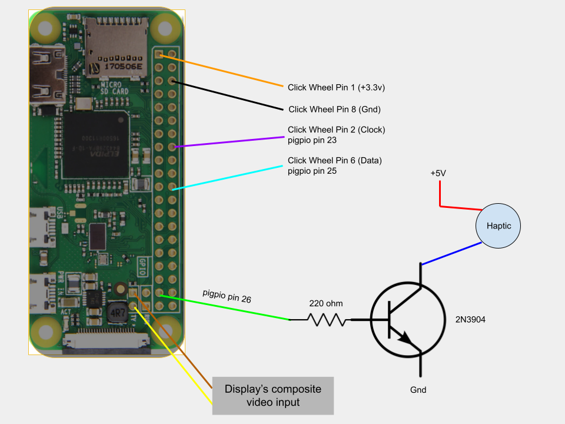

# sPot — iPod Spotify client (Raspberry Pi Zero 2 W)

[](https://github.com/Guiimartinho/ipod_spotify_rasp2w/actions/workflows/ci.yml)
[](./LICENSE)
[](https://www.python.org/)
[](https://www.raspberrypi.com/)

Turn a 2004 4th-gen iPod "Classic" into a Spotify Connect client. A Python/Tkinter UI
reproduces the classic iPod menu on the original screen, the original click-wheel is read by a
small C driver, and audio is played by [raspotify](https://github.com/dtcooper/raspotify)
(librespot). Everything runs on a **Raspberry Pi Zero 2 W**.

This is a maintained fork of [dupontgu/retro-ipod-spotify-client](https://github.com/dupontgu/retro-ipod-spotify-client)
(original [Hackaday writeup](https://hackaday.io/project/177034-spot-spotify-in-a-4th-gen-ipod-2004)),
re-targeted at the Pi Zero 2 W and hardened: pinned dependencies, JSON cache (no more pickle),
a thread-safe Spotify client, error handling/degraded mode, structured logging, and a
stdlib-only test suite.

- **Architecture, gotchas, and how to run/test:** see [`CLAUDE.md`](./CLAUDE.md).
- **Audit, bug fixes, and roadmap:** see [`.docs/AUDIT.md`](./.docs/AUDIT.md).
- **Deployment (systemd, auto-restart):** see [`deploy/`](./deploy).
- **Credits / original authors:** see [`CREDITS.md`](./CREDITS.md).
- **Contributing & commit conventions:** see [`CONTRIBUTING.md`](./CONTRIBUTING.md).
- **Run the tests:** `cd frontend && python -m unittest discover -s tests`

> Note: this repository preserves the **full original commit history** (with a leaked Spotify
> secret scrubbed out of it) and contains no secrets. Provide your own Spotify credentials via
> environment variables / `.env` (see `frontend/.env.example`).

## 🙏 Credits & acknowledgements

sPot stands entirely on the work of the original project,
**[dupontgu/retro-ipod-spotify-client](https://github.com/dupontgu/retro-ipod-spotify-client)**
by Guy Dupont, and its contributors. **Their full commit history is preserved in this repo** —
this fork only adds improvements on top. Huge thanks to:

[](https://github.com/dupontgu)
[](https://github.com/ElCapitanDre)
[](https://github.com/utkut)
[](https://github.com/rsappia)
[](https://github.com/3urobeat)
[](https://github.com/mitchLui)
[](https://github.com/tomaculum)

[Guy Dupont](https://github.com/dupontgu) · [André Silva](https://github.com/ElCapitanDre) ·
[Utku Tarhan](https://github.com/utkut) · [rsappia](https://github.com/rsappia) ·
[3urobeat](https://github.com/3urobeat) · [Mitch Lui](https://github.com/mitchLui) ·
[Tom](https://github.com/tomaculum) · Tobias Herrmann

See [`CREDITS.md`](./CREDITS.md) for details. Licensed under **GPL-3.0**, inherited from upstream.

Since we are using the lite version of raspbian, some extra packages need to be installed:

# Instructions

1. Install updates 

```
sudo apt-get update 
sudo apt-get upgrade
```
2. Install Required Packages.

Installation for python3-pip, raspotify, python3-tk, openbox
```

sudo apt install python-setuptools python3-setuptools

sudo apt install python3-pip

sudo curl -sL https://dtcooper.github.io/raspotify/install.sh | sh

sudo apt-get install python3-tk 

sudo apt-get install redis-server

sudo apt-get install openbox

sudo apt install xorg

sudo apt-get install lightdm

sudo apt-get install x11-xserver-utils

```
3. Install Dependencies

```
pip3 install -r requirements.txt
```

4. Install pi-btaudio
```
git clone https://github.com/bablokb/pi-btaudio.git
cd pi-btaudio
sudo tools/install
```
5. Install PiGPIO
```
wget https://github.com/joan2937/pigpio/archive/master.zip
unzip master.zip
cd pigpio-master
make
sudo make install
```

6. Setup Spotify API

First Create an App at https://developer.spotify.com/dashboard/applications/
```
https://accounts.spotify.com/authorize?client_id=XXXXXXXXXXXXXXXXXXXXXXXXXXXXX&response_type=code&redirect_uri=http%3A%2F%2F127.0.0.1&scope=user-read-playback-state%20user-modify-playback-state%20user-read-currently-playing%20	app-remote-control%20streaming%20playlist-modify-public%20playlist-modify-private%20playlist-read-private%20playlist-read-collaborative
```


7. raspi-config

` sudo raspi-config`

_Console Autologin_

_Display Option -> Screen Blanking -> Off_ if you want to avoid the screen turning black after a few seconds.


8. bash_profile

In *.bash_profile* added the following (if the file is not htere, you must create it)

```
#!/bin/bash

[[ -z $DISPLAY && $XDG_VTNR -eq 1 ]] && startx -- -nocursor

# Disable any form of screen saver / screen blanking / power management

xset s off

xset s noblank
```

9. Configure xinitrc

`sudo nano /etc/X11/xinit/xinitrc`


Inside, make sure the following is there:
```
#!/bin/sh

# /etc/X11/xinit/xinitrc

# global xinitrc file, used by all X sessions started by xinit (startx)

# invoke global X session script

#. /etc/X11/Xsession

exec openbox-session #-> This is the one that launches Openbox ;)
```
10. Run "spotifypod.py" with autostart

First build the click-wheel driver (needs `pigpio` installed — see step 5):

```
cd clickwheel && make
```

`sudo nano /etc/xdg/openbox/autostart`


and add the following command to launch spotifypod.py (adjust the paths to match where you cloned
this repo):

```
cd /home/pi/fork/retro-ipod-spotify-client/frontend/

sudo -H -u pi python3 spotifypod.py &

sudo /home/pi/fork/retro-ipod-spotify-client/clickwheel/click &
```

_Make sure that the paths are ok with your setup!!_

in ` sudo nano /etc/xdg/openbox/environment` all the variables needed to run spotifypod.py are set( SPOTIPY_CLIENT_ID, SPOTIPY_CLIENT_SECRET,SPOTIPY_REDIRECT_URI)

```
export SPOTIPY_CLIENT_ID='your_SPOTIPY_CLIENT_ID'

export SPOTIPY_CLIENT_SECRET='your_SPOTIPY_CLIENT_SECRET'

export SPOTIPY_REDIRECT_URI='your_SPOTIPY_REDIRECT_URI'
```

11. Synchronizing Spotify data!
Last but not least, if you want to make sure all your playlists artists, etc are synchronized every time you turn on your Spotypod, you can simply modify the script view_model.py with the following at line 16:

`#spotify_manager.refresh_devices()`

`spotify_manager.refresh_data()`


instead of calling refresh_device, you can execute refresh_data. This will sync all your data and then will eceute refresh.devices. This will make the boot up way slower! but it will synchronize every single time you switch on :). 
If you dont run at least once `refresh_data()` no playlist, artist or anything related with your account will be displayed!

12. Configure Raspotify

`sudo nano /etc/default/raspotify`


Uncomment and fill the following line:

`OPTIONS="--username <USERNAME> --password <PASSWORD>"`


And maybe you want also to consider the following:

```
# The displayed device type in Spotify clients. 

# Can be "unknown", "computer", "tablet", "smartphone", "speaker", "tv",

# "avr" (Audio/Video Receiver), "stb" (Set-Top Box), and "audiodongle".

DEVICE_TYPE="smartphone"
```

# Wiring

Here is the wiring of the hardware, as of revision 1. Note that the pin numbers correlate to those referenced in [click.c](./clickwheel/click.c)

